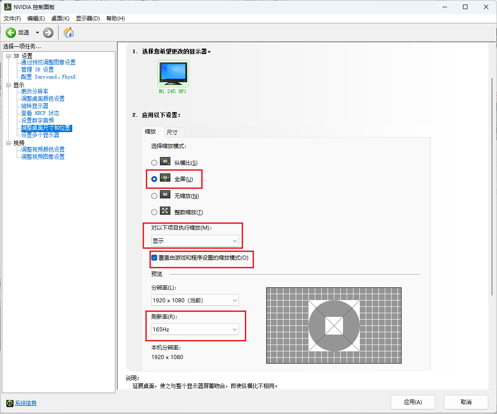

# 调机器优化

针对FPS游戏进行系统优化，适用中高配置电脑。

## N卡优化

1. 管理3D设置
   

2. 调整桌面尺寸和位置
   

3. 配置Surround PhysX
   

## 系统设置

1. 显示卡设置（替换为对应游戏）
   

2. 禁用全屏优化（找到对应的游戏程序，右键属性）
   

<br/>

## Apex游戏设置

1. 启动项设置
```
-novid -mat_minmize_on_alt_tab1 +lobby_max_fps0 -high +fps_max unlimited

```